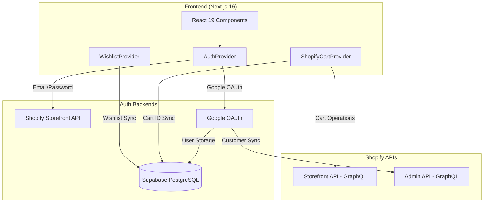
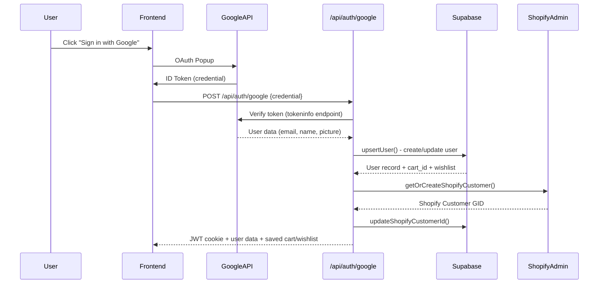
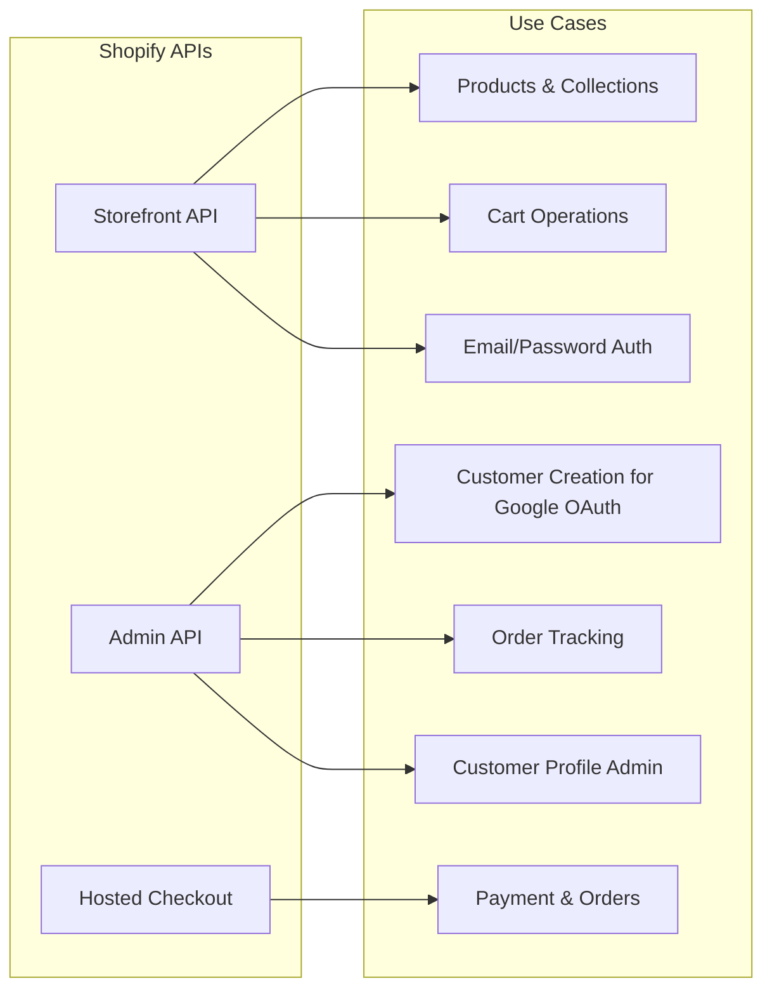
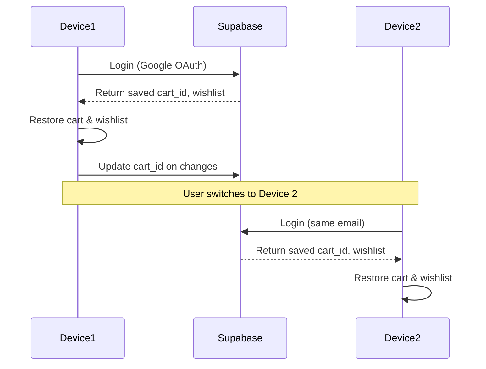

# House of Kumaran - Complete Architecture Deep Dive

> **Generated:** December 23, 2025  
> **Purpose:** Comprehensive technical documentation of auth flows, integrations, and data sources

---

## Table of Contents

1. [Architecture Overview](#architecture-overview)
2. [Authentication System](#authentication-system)
3. [Supabase Integration](#supabase-integration)
4. [Shopify Integration](#shopify-integration)
5. [Cart & Checkout Flow](#cart--checkout-flow)
6. [Data Flow Diagrams](#data-flow-diagrams)
7. [API Routes Reference](#api-routes-reference)
8. [Environment Variables](#environment-variables)

---

## Architecture Overview



### Tech Stack Summary

| Layer | Technology |
|-------|-----------|
| **Frontend** | Next.js 16 (App Router), React 19, TypeScript |
| **Styling** | Tailwind CSS 4, shadcn/ui (Radix UI) |
| **Auth (Email)** | Shopify Storefront API (Customer Account API) |
| **Auth (Google)** | Google OAuth → Supabase |
| **Database** | Supabase (PostgreSQL) for Google auth users |
| **E-commerce** | Shopify Storefront API + Admin API |
| **Checkout** | Shopify Hosted Checkout (`shop.houseofkumaran.com`) |

---

## Authentication System

The app implements a **dual authentication system** supporting two methods:

### 1. Email/Password Auth (Shopify Storefront API)

**Flow:**
```
User → Email + Password → Shopify Storefront API → Access Token → localStorage
```

**Key Files:**
- [lib/shopify-customer.ts](file:///d:/Work/MakeScale/HouseOfKumaran/hok-green/house-of-kumaran-green/lib/shopify-customer.ts) — All Storefront API customer operations
- [lib/auth-context.tsx](file:///d:/Work/MakeScale/HouseOfKumaran/hok-green/house-of-kumaran-green/lib/auth-context.tsx#L179-L213) — `login()` function

**API Functions:**
| Function | Purpose |
|----------|---------|
| `customerAccessTokenCreate()` | Login - returns access token |
| `customerCreate()` | Register new customer |
| `customerRecover()` | Send password reset email |
| `getCustomer()` | Fetch customer profile with token |
| `customerUpdate()` | Update profile (name, phone, etc.) |
| `customerAddressCreate/Update/Delete()` | Address management |

**Storage:**
- `shopify_customer_token` → localStorage (access token)
- `shopify_customer_token_expiry` → localStorage (expiry date)

---

### 2. Google OAuth (Supabase Backend)

**Flow:**


**Key Files:**
- [app/api/auth/google/route.ts](file:///d:/Work/MakeScale/HouseOfKumaran/hok-green/house-of-kumaran-green/app/api/auth/google/route.ts) — Google OAuth API endpoint
- [lib/supabase-user.ts](file:///d:/Work/MakeScale/HouseOfKumaran/hok-green/house-of-kumaran-green/lib/supabase-user.ts) — Supabase user operations
- [lib/shopify-admin.ts](file:///d:/Work/MakeScale/HouseOfKumaran/hok-green/house-of-kumaran-green/lib/shopify-admin.ts) — Admin API customer creation

**Cookies Set:**
| Cookie | HttpOnly | Purpose |
|--------|----------|---------|
| `hok_auth_token` | Yes | JWT session token (30 days) |
| `hok_auth_status` | No | Client-side auth check |

---

### Route Protection (Middleware)

Protected routes: `/account/*`

**File:** [middleware.ts](file:///d:/Work/MakeScale/HouseOfKumaran/hok-green/house-of-kumaran-green/middleware.ts)

**Logic:**
1. Check for `hok_auth_token` cookie (Google OAuth) → verify JWT
2. Check for `shopify_customer_token` cookie (email auth) → allow pass-through
3. No tokens → redirect to `/?auth=required`

---

## Supabase Integration

### When Supabase is Used

| Use Case | Description |
|----------|-------------|
| **Google OAuth User Storage** | Users who sign in with Google are stored in Supabase |
| **Cart ID Sync** | Shopify cart IDs saved for cross-device restoration |
| **Wishlist Sync** | Product IDs in wishlist saved for cross-device access |
| **Shopify Customer ID Link** | Maps Supabase user → Shopify customer GID |

### Supabase `users` Table Schema

```sql
CREATE TABLE users (
  id UUID PRIMARY KEY DEFAULT uuid_generate_v4(),
  email TEXT UNIQUE NOT NULL,
  name TEXT,
  picture TEXT,
  cart_id TEXT,                    -- Shopify cart ID
  wishlist_product_ids TEXT[],     -- Array of product IDs
  shopify_customer_id TEXT,        -- Shopify Admin API customer GID
  created_at TIMESTAMPTZ DEFAULT NOW(),
  updated_at TIMESTAMPTZ DEFAULT NOW()
);
```

### Supabase API Functions

**File:** [lib/supabase-user.ts](file:///d:/Work/MakeScale/HouseOfKumaran/hok-green/house-of-kumaran-green/lib/supabase-user.ts)

| Function | Purpose |
|----------|---------|
| `upsertUser()` | Create or update Google OAuth user |
| `getUserByEmail()` | Fetch user by email |
| `updateCartId()` | Save Shopify cart ID |
| `updateWishlist()` | Save wishlist product IDs |
| `updateShopifyCustomerId()` | Link Supabase user to Shopify customer |

---

## Shopify Integration

### Three Shopify APIs Used



---

### 1. Storefront API (Public, GraphQL)

**Token:** `NEXT_PUBLIC_SHOPIFY_STOREFRONT_ACCESS_TOKEN`

**File:** [lib/shopify.ts](file:///d:/Work/MakeScale/HouseOfKumaran/hok-green/house-of-kumaran-green/lib/shopify.ts)

**Operations:**

| Category | Functions |
|----------|-----------|
| **Products** | `getAllProducts()`, `getProductByHandle()`, `getProductsByCollection()`, `searchProducts()` |
| **Cart** | `createCart()`, `getCart()`, `addToCart()`, `updateCartLines()`, `removeFromCart()` |
| **Checkout** | `updateCartBuyerIdentity()` — pre-fills email at checkout |

---

### 2. Admin API (Private, GraphQL)

**Token:** `HOK_CUSTOMER_SYNC_ACCESS_TOKEN` (Partner App OAuth)

**File:** [lib/shopify-admin.ts](file:///d:/Work/MakeScale/HouseOfKumaran/hok-green/house-of-kumaran-green/lib/shopify-admin.ts)

**When Used:**
- Google OAuth sign-in → create/find Shopify customer
- Account page → fetch customer profile, orders, addresses
- Customer tagging (Kumaran Family membership)

**Operations:**

| Function | Purpose |
|----------|---------|
| `getOrCreateShopifyCustomer()` | Find or create customer by email |
| `findCustomerByEmail()` | Search customers |
| `createCustomerFromGoogle()` | Create new customer with tags |
| `getCustomerById()` | Fetch full profile with addresses |
| `getCustomerOrders()` | Fetch order history |
| `updateCustomerProfile()` | Update name, phone, marketing |
| `addCustomerAddress()` | Add shipping address |
| `deleteCustomerAddress()` | Remove address |

---

### 3. Hosted Checkout

**Domain:** `shop.houseofkumaran.com` (Shopify primary domain)

The checkout URL from Shopify's Cart API is transformed to use the `shop.` subdomain:
- Original: `www.houseofkumaran.com/cart/c/...`
- Transformed: `shop.houseofkumaran.com/cart/c/...`

This ensures checkout goes to Shopify (handling payments) instead of Vercel (Next.js frontend).

---

### Product Service Abstraction

**File:** [lib/product-service.ts](file:///d:/Work/MakeScale/HouseOfKumaran/hok-green/house-of-kumaran-green/lib/product-service.ts)

**Toggle:** `NEXT_PUBLIC_USE_SHOPIFY=true|false`

| Mode | Data Source | Use Case |
|------|-------------|----------|
| Static | `lib/products.ts` | Development, offline |
| Shopify | Storefront API | Production |

```typescript
// Automatic fallback pattern
if (!USE_SHOPIFY) return staticProducts;
try {
  return await shopifyFetch();
} catch {
  return staticProducts; // Fallback on error
}
```

---

## Cart & Checkout Flow

### Cart Context

**File:** [lib/shopify-cart-context.tsx](file:///d:/Work/MakeScale/HouseOfKumaran/hok-green/house-of-kumaran-green/lib/shopify-cart-context.tsx)

**Features:**
- Syncs with Shopify Cart API
- Persists cart ID to localStorage
- Syncs cart ID to Supabase for Google OAuth users
- Associates buyer identity (email) for checkout prefill

### Cross-Device Cart/Wishlist Sync



---

## API Routes Reference

### Authentication

| Route | Method | Purpose |
|-------|--------|---------|
| `/api/auth/google` | POST | Google OAuth login |
| `/api/auth/google` | GET | Verify session |
| `/api/auth/google` | DELETE | Logout |

### Customer Management

| Route | Method | Purpose |
|-------|--------|---------|
| `/api/customer/profile` | GET/PUT | Get/update customer profile |
| `/api/customer/orders` | GET | Fetch order history |
| `/api/customer/wishlist` | GET/POST | Get/save wishlist |
| `/api/customer/cart` | GET/POST | Get/save cart ID |
| `/api/customer/join-family` | POST | Add Kumaran Family tag |
| `/api/customer/register-family` | POST | Add family tag on signup |

### Data Sync

| Route | Method | Purpose |
|-------|--------|---------|
| `/api/user/sync` | POST | Sync cart/wishlist to Supabase |
| `/api/user/sync` | GET | Fetch cart/wishlist from Supabase |

### Other

| Route | Method | Purpose |
|-------|--------|---------|
| `/api/products/[id]` | GET | Fetch single product |
| `/api/search` | GET | Product search |
| `/api/reviews` | GET/POST | Product reviews (Judge.me) |
| `/api/track-order` | POST | Track order by number |
| `/api/newsletter/subscribe` | POST | Newsletter signup |

---

## Environment Variables

### Required

```env
# Shopify Storefront API (public)
NEXT_PUBLIC_SHOPIFY_STORE_DOMAIN=houseofkumaran.myshopify.com
NEXT_PUBLIC_SHOPIFY_STOREFRONT_ACCESS_TOKEN=xxx
NEXT_PUBLIC_SHOPIFY_API_VERSION=2025-10

# Google OAuth
NEXT_PUBLIC_GOOGLE_CLIENT_ID=xxx

# Supabase
NEXT_PUBLIC_SUPABASE_URL=xxx
NEXT_PUBLIC_SUPABASE_ANON_KEY=xxx
SUPABASE_SERVICE_ROLE_KEY=xxx  # Server-side only

# JWT
JWT_SECRET=xxx
```

### Optional

```env
# Enable Shopify API (default: false = use static data)
NEXT_PUBLIC_USE_SHOPIFY=true

# Shopify Admin API (for customer sync, orders)
HOK_CUSTOMER_SYNC_ACCESS_TOKEN=xxx

# Custom checkout domain
NEXT_PUBLIC_SHOPIFY_CHECKOUT_DOMAIN=shop.houseofkumaran.com
```

---

## Summary Decision Matrix

| Scenario | Primary System | Fallback |
|----------|----------------|----------|
| Email/Password Login | Shopify Storefront API | — |
| Google OAuth Login | Supabase + Shopify Admin | Supabase only |
| Product Data | Shopify Storefront API | Static `lib/products.ts` |
| Cart Operations | Shopify Cart API | localStorage |
| Wishlist Storage | Supabase (Google) / localStorage (email) | localStorage only |
| Checkout | Shopify Hosted Checkout | — |
| Order Tracking | Shopify Admin API | — |
| Customer Profile | Shopify Storefront (email) / Admin (Google) | — |
